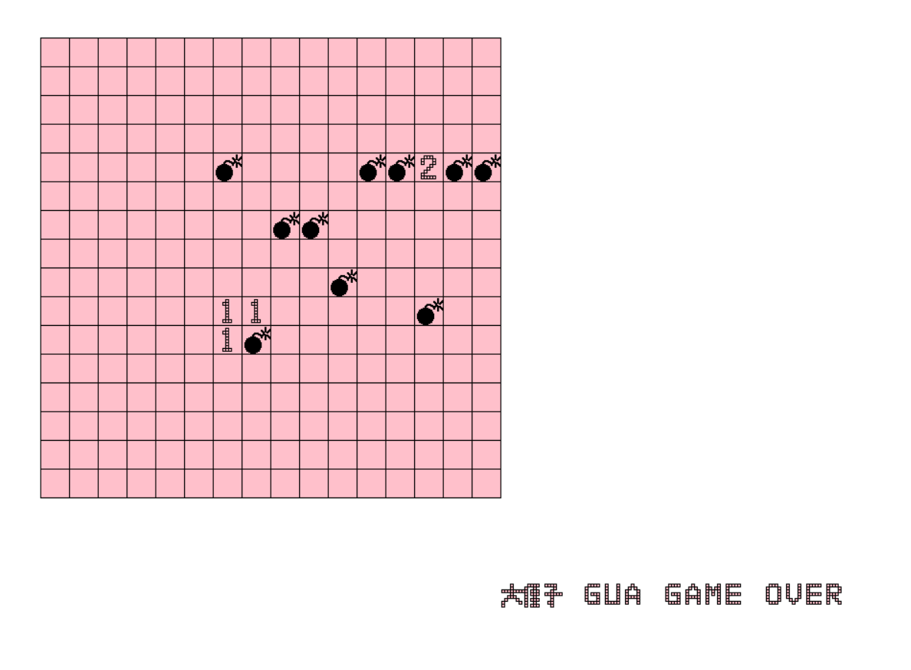

# word and sweep_mineline

> 仓颉造字 和 扫雷

### 1. 项目截图

####  word：

 
 
####  sweep_mineline：

### 2. 思路

- mineline (py):
    - mine_map(地图）：
        - square_square:
            -  line_square:
                - square:
                    - 坐标：
                        - x 坐标
                        - y 坐标
                    - length 长度
                    - 颜色：
                        - fill_color
                        - edge_color
    - algorithm(算法）：
       - random_mine(随机生成雷 + 限制雷的数量）：
            - random_square_09（二维数组）：
                 - random_line09（一维数组）：
                   -  random01(有雷没有雷)：
                        - 0 没有
                        - 1 有
        
       - marked_square（标记雷 前后左右 计算出雷周围的数字）：
            - marked_around（标记四周 没有雷的元素）：
                - 加 1 
                
       - draw（显示文本 + 棋盘上绘制出雷）：画像素的功能
            - block:
                - line:
                - pixel:
                   - x 坐标
                   - y 坐标
                   - size
                   - color
        
   - events(事件）：
        - click:
            - click_time(记录点击次数)
            - 位置(x, y):
                -  获取对应的值:
                    - 不是雷：
                       - 显示文本信息
                    - 是雷：
                       - 画雷
                       - 游戏结束
            
   - else(其他功能 未完成):
        - 算法:  
            - 防止第一个就点到雷
            - 点击位置数字为 0 周围没有雷位置 默认再点击 写一个递归
     
 ## 3. 总结：
 
 - 用画像素的功能来写一个「画字符程序 (戏称为 仓颉造字)
 - 用自己写的画图程序做出数字、雷、文本的字符（自己造字）  eg: 大侄子
 - 用自己造的字体、图案实现扫雷的界面(因为根本没提供画图片的功能)
 - 因为一切都是自制，所以你看下面的截图都是千奇百怪的
 - 注意, 因为这个程序是从最底层开始软件模拟的, 所以你看动图会觉得很慢, 这是很正常的  